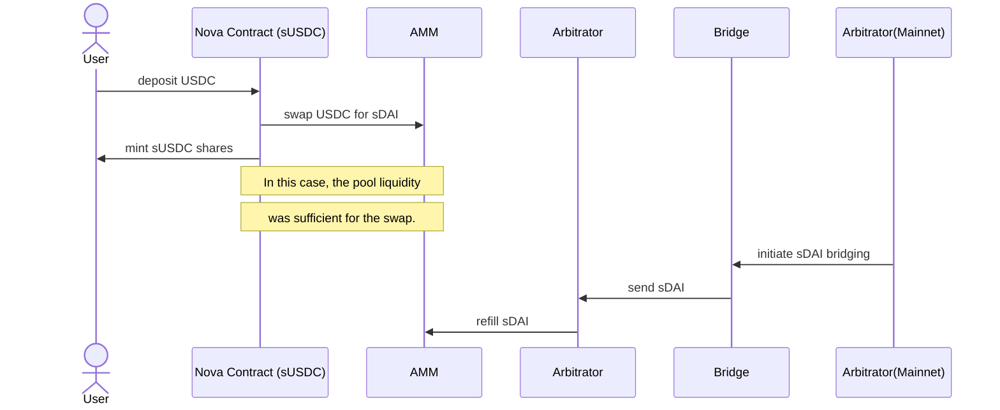

# sDAI for the regular user

On a relatively large number of countries, DAI isn't what users are used to. They usually place their savings in other stablecoins, such as USDT (Tether) and USDC (Circle) - both of which don't pay them any APR for holding them. If they want to get any rate for those stablecoins, their only choice is to find an existing strategy that might pay some APR for their stablecoins.

These strategies include usage of lending markets, liquidity pools and other technically complex solutions.

## The Nova Contract
The Nova Contract is an adapter for sDAI, which lets users harness the yield paid by Maker to DAI holders - all while still using their stablecoin of choice. This contract exchanges their stablecoin for sDAI in both directions, and allows users and integrators to more easily view their stablecoin balance and the rate users have been paid so far. The system looks the following way

The minted sUSDC is thus a thin wrapper over the bridged sDAI, since it can always be exchanged 1:1 for sDAI, and the latter can be exchanged for USDC in the AMM. As long as the market is liquid, users can expect to be able to withdraw their sUSDC shares for USDC. See [Bridging sDAI](./bridging_sdai.md) for more details on that.