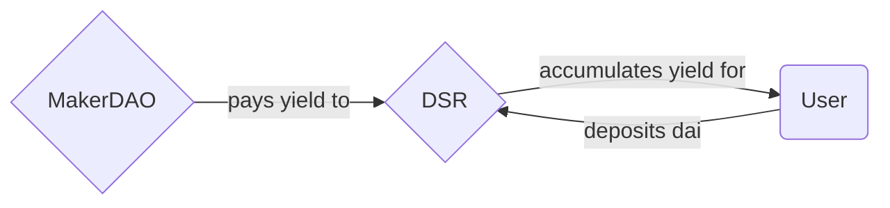
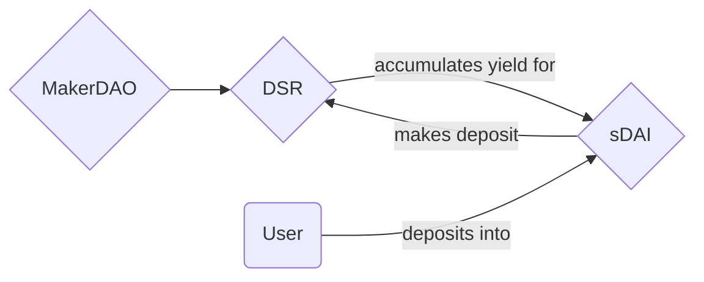

# What is sDAI?

    <!-- inline sDAI logo svg -->
    <svg width="200" height="200" viewBox="0 0 600 600" fill="none" xmlns="http://www.w3.org/2000/svg">
        <g clip-path="url(#clip0_11487_104319)">
            <path d="M300 600C465.685 600 600 465.685 600 300C600 134.315 465.685 0 300 0C134.315 0 0 134.315 0 300C0 465.685 134.315 600 300 600Z" fill="url(#paint0_radial_11487_104319)"/>
            <path d="M464.422 254.277H431.496C413.442 203.989 364.676 169.472 300.484 169.472H194.789V254.208H158.059V284.644H194.789V316.532H158.059V346.968H194.789V430.736H300.415C363.915 430.736 412.267 396.565 430.874 346.968H464.422V316.532H438.275C438.898 311.137 439.313 305.603 439.313 300.069V299.308C439.313 294.328 439.036 289.417 438.552 284.644H464.561V254.208L464.422 254.277ZM224.395 196.588H300.484C347.66 196.588 382.661 219.76 398.847 254.208H224.395V196.588ZM300.484 403.343H224.395V346.899H398.64C382.384 380.724 347.452 403.343 300.484 403.343ZM408.739 300.761C408.739 306.156 408.393 311.414 407.632 316.463H224.395V284.575H407.701C408.324 289.555 408.739 294.743 408.739 300V300.761Z" fill="white"/>
        </g>
        <defs>
        <radialGradient id="paint0_radial_11487_104319" cx="0" cy="0" r="1" gradientUnits="userSpaceOnUse" gradientTransform="translate(196 143.5) rotate(54.1675) scale(497.082)">
            <stop stop-color="#8DD053"/>
            <stop offset="1" stop-color="#41A035"/>
        </radialGradient>
        <clipPath id="clip0_11487_104319">
            <rect width="600" height="600" fill="white"/>
        </clipPath>
        </defs>
    </svg>

**sDAI** is MakerDAO's yield bearing token, which acts as an index of Maker's return on its investment portfolio. The interest rate paid is set by the [Maker Governance](https://vote.makerdao.com) depending on market conditions. It is an evolution of Maker's _DAI Savings Rate_, which is functionally similar but does not have a token representation.

## Understanding the DAI Savings Rate (DSR)

MakerDAO offers the Savings Rate as one of its monetary policy tools, and uses it to influence the supply and demand for _DAI_ by making it either more attractive to hold or to exchange for other stablecoins. The yield paid by the Savings Rate is directly informed by the return on Maker's loans, be them _CDPs_[^1], loans to other entities (i.e. [Spark](https://spark.fi)) or, most recently, [Ethena](https://ethena.fi).

It is worth noting that the _DSR_ accepts deposits and withdrawals at no cost to the end user (apart from gas fees). For more in-depth technical information on the DSR, check out [the official DSR docs](https://docs.makerdao.com/smart-contract-modules/rates-module/pot-detailed-documentation).

**sDAI** offers a much easier way to interact and integrate with this system.

## How it works

**sDAI** is a wrapper contract built on top of the existing _DAI Savings Rate_ which represents user balances in the form of an [ERC4626 vault](https://eips.ethereum.org/EIPS/eip-4626). This enables use cases that weren't possible before, including but not limited to:

- Better support for the DAI Savings Rate on wallets
- Easy transfers of staked balances
- Bridging the yield over to L2 and alt-L1 networks

It effectively sits between end users and integrators to provide a better interface for the DAI Savings Rate, minimizing user friction and enabling usage of this yield on DeFi.

sDAI has been successfully integrated as a core piece of other protocol's infrastructure, such as [Blast](), where it is used as the basis for all stablecoins held in the network.

!!! note
    The **sDAI** vault contract on Ethereum Mainnet is located at [0x83F20F44975D03b1b09e64809B757c47f942BEeA](https://etherscan.io/token/0x83F20F44975D03b1b09e64809B757c47f942BEeA).

## sDAI's value proposition on other domains

Being a tokenized vault, it is possible to offer users this yield on other, low transaction fee domains. This enables users to harness this yield offering at a lower cost of entry, and encourages its use as a high-yield savings account, accessible by people for whom Ethereum transaction fees are unfeasibly high.

Users or integrators may acquire sDAI on Mainnet by minting it from the contract directly, or on other domains by acquiring it from an Automated Market Maker such as [Uniswap](https://uniswap.org). We recommend usage of our SDK for this reason, since it is directly pointed to the best-performing AMMs for this purpose.

[^1]: Collateralized Debt Positions
